## 📌 Pertemuan 1

Pada pertemuan pertama, dilakukan pembuatan tampilan dasar aplikasi serta proses input dan penampilan data.

### 🔹 Tampilan Home
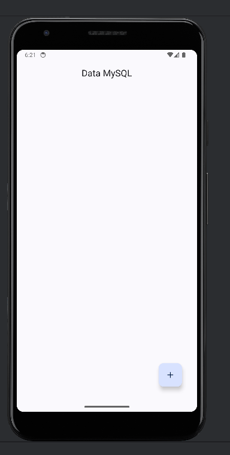  
*Gambar 1: Halaman Home aplikasi.*

### 🔹 Halaman Entry / Tambah Data
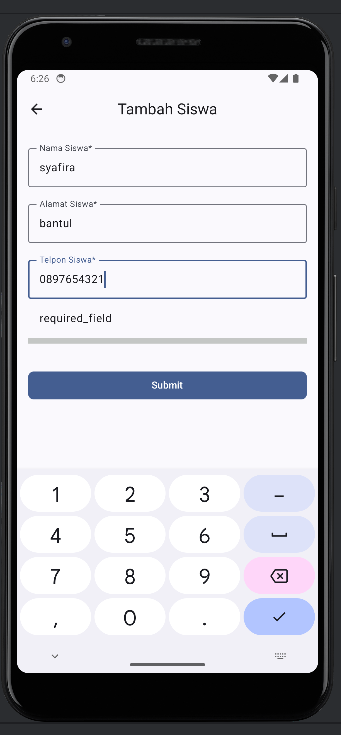  
*Gambar 2: Halaman Entry / Form tambah data.*

### 🔹 Hasil Setelah Entry Data
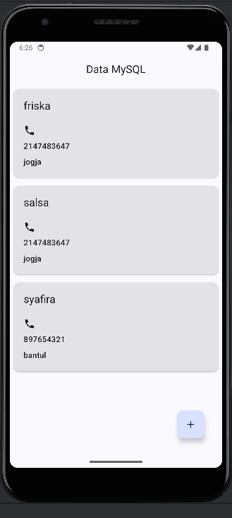  
*Gambar 3: Hasil setelah Entry data.*

### 🔹 Struktur Database
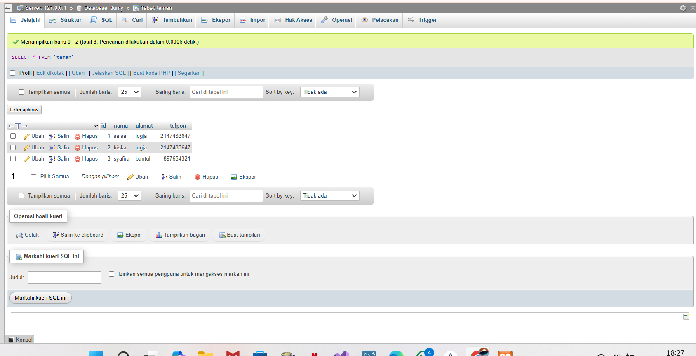  
*Gambar 4: Struktur database teman.*

---

## 📌 Pertemuan 2

Pada pertemuan kedua, aplikasi dikembangkan dengan fitur **detail data, edit data, dan hapus data** serta integrasi database yang lebih lengkap.

### 🔹 Tampilan Awal Home
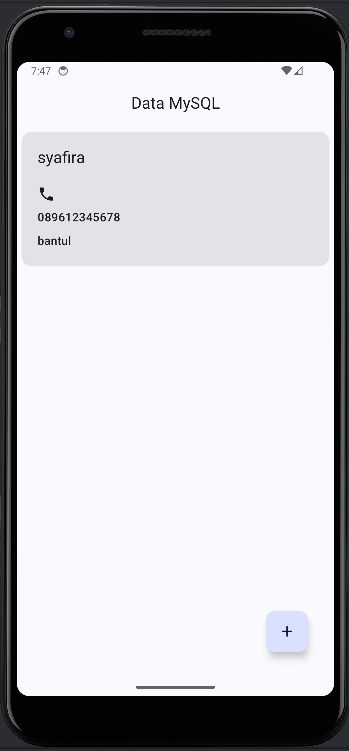  
*Gambar 5: Tampilan awal halaman Home pada aplikasi.*

### 🔹 Halaman Tambah Data Siswa
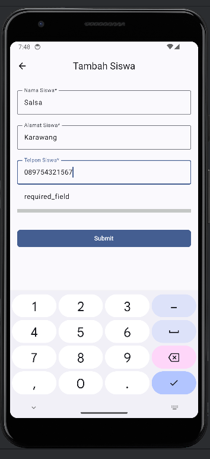  
*Gambar 6: Halaman form tambah data siswa.*

### 🔹 Proses Tambah Data ke Database
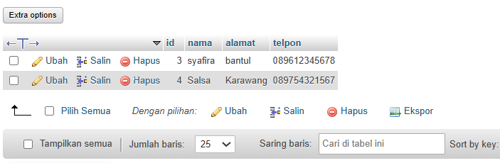  
*Gambar 7: Proses penambahan data ke dalam database.*

### 🔹 Hasil Tambah Data
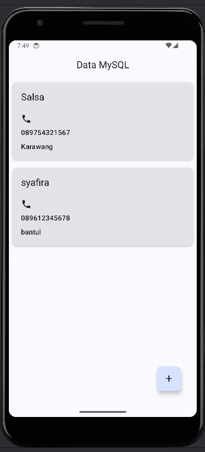  
*Gambar 8: Tampilan hasil setelah data berhasil ditambahkan.*

### 🔹 Halaman Detail Siswa
  
*Gambar 9: Halaman detail data siswa.*

### 🔹 Halaman Edit Data Siswa
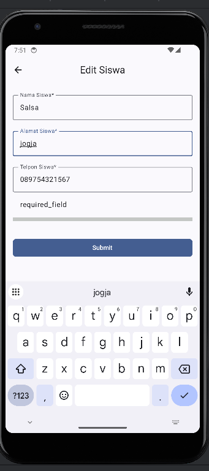  
*Gambar 10: Halaman edit data siswa.*

### 🔹 Proses Update Data
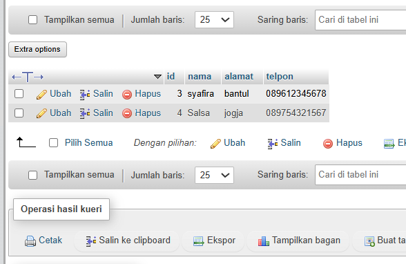  
*Gambar 11: Proses update data pada database.*

### 🔹 Hasil Setelah Update
  
*Gambar 12: Tampilan data setelah dilakukan update.*

### 🔹 Proses Hapus Data
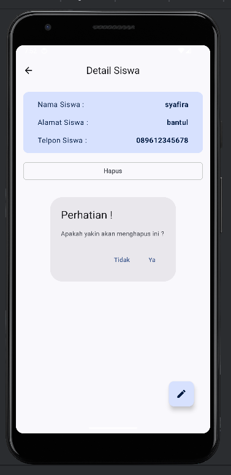  
*Gambar 13: Proses penghapusan data siswa.*

### 🔹 Proses Delete pada Database
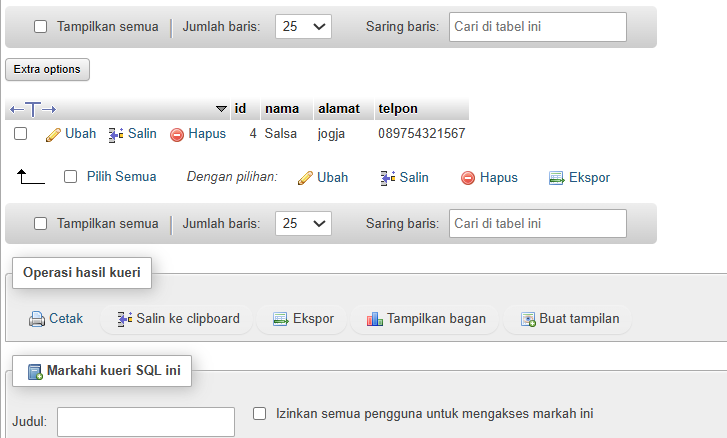  
*Gambar 14: Data berhasil dihapus dari database.*

### 🔹 Hasil Setelah Delete
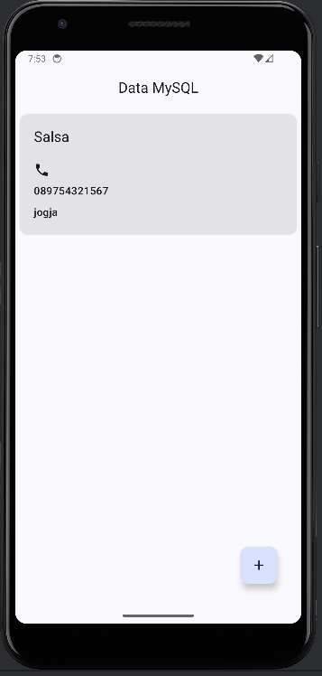  
*Gambar 15: Tampilan data setelah dilakukan penghapusan.*

---

